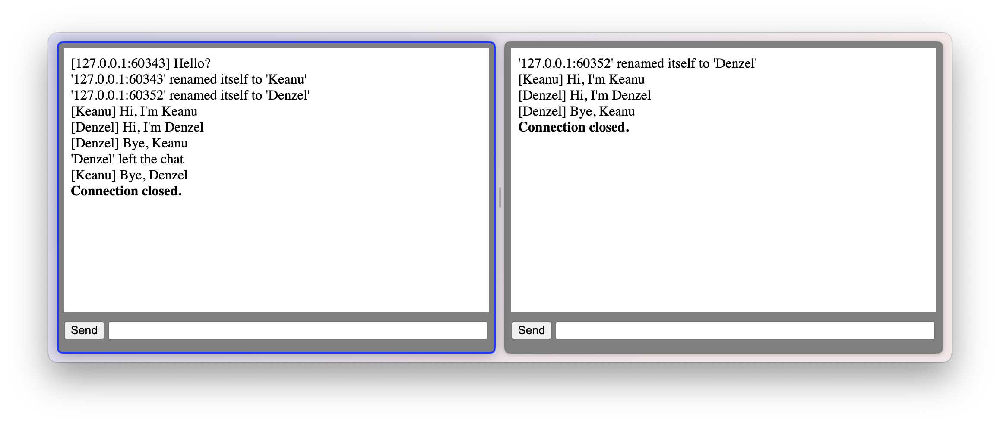

# Websocket

- websockets layer
  - [release-2.2.1-alpha](https://github.com/libevent/libevent/releases/tag/release-2.2.1-alpha)
  - [pull request #1322](https://github.com/libevent/libevent/pull/1322): Add minimal WebSocket server implementation for evhttp

## Build

### without ws.h

```bash
clang -Wall -W -pedantic -o a.out main.c -levent
main.c:5:10: fatal error: 'event2/ws.h' file not found
    5 | #include <event2/ws.h>
      |          ^~~~~~~~~~~~~
1 error generated.
make: *** [Makefile:8: all]
```

### with ws.h

#### Latest Version

[How to build libevent](/refs/libevent/README.md)

```bash
CompileFlags:
  Add:
    - "-I/<ABSOLUTE_PATH>/libevent/build/include/" # evconfig-private.h
    - "-I/<ABSOLUTE_PATH>/dist/include"
```

#### Build with ws.h

```bash
ABSOLUTE_PATH=/<ABSOLUTE_PATH>

make clean

make \
CFLAGS="-I${ABSOLUTE_PATH}/dist/include -I${ABSOLUTE_PATH}/libevent/build/include/" \
LIBS="-L${ABSOLUTE_PATH}/dist/lib -levent"
```

## Server

```bash
# linux
LD_LIBRARY_PATH="${ABSOLUTE_PATH}/dist/lib" ./a.out

Server runs
```

## Client

Open: [index.html](index.html)

## Log

### Server Log

```log
Server runs

New client joined from 127.0.0.1:60343
[127.0.0.1:60343] Hello?
'127.0.0.1:60343' renamed itself to 'Keanu'

New client joined from 127.0.0.1:60352
'127.0.0.1:60352' renamed itself to 'Denzel'

[Keanu] Hi, I'm Keanu
[Denzel] Hi, I'm Denzel
[Denzel] Bye, Keanu
'Denzel' left the chat
'Denzel' disconnected
[Keanu] Bye, Denzel

# CTRL-C

Interrupt: 2 signal received

Active connections: 1
'Keanu' disconnected
```

### Client View

```txt
/name Keanu
Hi, I'm Keanu
/quit
```




